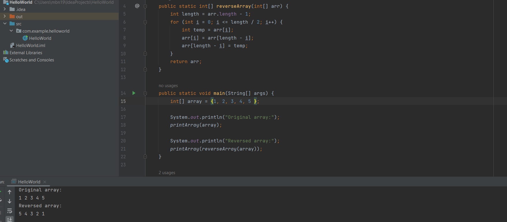

# Data Structure Reverse Array
<!-- Description of the  -->
challenge is a simple task where you are required to take an array and reverse the order of its elements. In other words, the element at the beginning of the array becomes the last element, the second element becomes the second-to-last element, and so on.
## Whiteboard Process
<!-- Embedded whiteboard image -->

### the code

### Approach & Efficiency
<!-- What approach did you take? Why? What is the Big O space/time for this approach? -->
### approach
* i use a for loop that iterates from the beginning of the array (index 0) to the middle of the array (approximately array.length / 2).

* Inside the loop, you perform the swap operation. You swap the element at the current index with the corresponding element from the end of the array. For example, you swap the element at index i with the element at index array.length - i - 1.

* By the time the loop reaches the middle of the array, all elements have been swapped, resulting in the reversed array.

### Big O space/time
 * Time Complexity O(N/2) = O(N)
 * Space Complexity O(1)
## Solution
<!-- Show how to run your code, and examples of it in action -->

### run code examples 
**even element number**

**odd element number**

**single element**
