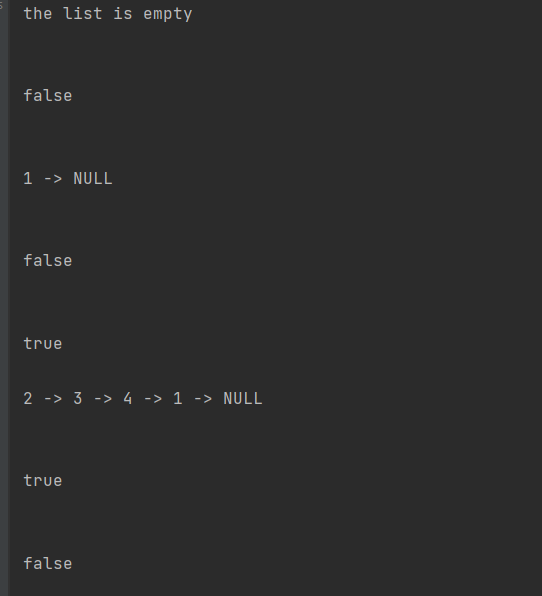

# linkedlist implementation  
<!-- Description of the  -->
the challenge is a task that Ruqier implements a singly linked list and adds 3 methods 
<ol>
<li>add element at the first index of the list </li>  
<li>add element at the end of list</li>
<li>add element before specific element</li> 
<li>add element after specific element</li> 
</ol> 

## Whiteboard Process
<!-- Embedded whiteboard image -->
.png)
### the code

```

public class LinkedList {
    private class Node {
        int val;
        Node next;

        Node(int val) {
            this.val = val;
        }
    }

    private Node head = null;
    private Node tail = null;

    private boolean isEmpty() {
        return (head == null);
    }

    public void insert(int val) {
        Node newNode = new Node(val);
        if(!isEmpty()){
            newNode.next=head;

        }
        else{
            tail=newNode;
        }

        head=newNode;

    }
    public boolean isInclude(int val) {
        Node temp=head;
        while (temp != null) {

            if(temp.val==val)return true;

            temp = temp.next;
        }

        return false;
    }

    public void append(int val){
        if(isEmpty()){
            insert(val);
        }else {
        Node newNode=new Node(val);
        tail.next=newNode;
        newNode.next=null;
        tail=newNode;
    }
    }
    public void insertBefore(int val,int newVal){
        if(!isInclude(val)){
            return ;
        }
        if(head.val==val){
            insert(newVal);
            return ;
        }
        Node temp=head;
        while(temp.next.val !=val){
            temp=temp.next;
        }
        Node newNode = new Node(newVal);
        newNode.next=temp.next;
        temp.next=newNode;
    }

    public void insertAfter(int val , int newVal){
        if(!isInclude(val)){
            return ;
        }
        if(tail.val==val){
            append(newVal);
            return ;
        }
        Node temp=head;
        while(temp.val !=val){
            temp=temp.next;
        }
        Node newNode = new Node(newVal);
        newNode.next=temp.next;
        temp.next=newNode;
    }
    @Override
    public String toString() {
        String ans = "";
        if (isEmpty()) {
            ans="the list is empty";

        } else {
            Node temp = head;

            while (temp != null) {

                ans += temp.val;
                ans += " -> ";
                temp = temp.next;
            }
            ans += "NULL";

        }

        return ans;
    }
}


```

### Approach & Efficiency
<!-- What approach did you take? Why? What is the Big O space/time for this approach? -->
### approach
**insert()**
1- crate new node 

2- make next pointer of the new node popint at the head
 
3- make the new node the head 

**append()**

1- crate new node 

2- make next pointer of the new node popint at null
 
3-make tail next on new node

4- make the new node the tail

**insertBefore()**

1- crate new node 

2- search for element we want but new node before 
 
3-make new node next on element we searches

4- make the next of element before element we searches on new node 

**insertAfter()**

1- crate new node 

2- search for element we want but new node before 
 
3-make new node next on next node of element we searches

4- make the next of element we searches   element on new node 

### Big O space/time
 **for append() & insert()**
 * Time Complexity  O(1)
 * Space Complexity O(1)

  **for insertBefore() & insertAfter()**
 * Time Complexity  O(n)
 * Space Complexity O(1)
## Solution
<!-- Show how to run your code, and examples of it in action -->
### test code 
```
public class LinkedListTest {
    @Test
    void testInsertAndToString() {
        LinkedList list = new LinkedList();
        list.insert(5);
        list.insert(10);
        list.insert(15);

        assertEquals("15 -> 10 -> 5 -> NULL", list.toString());
    }


    @Test
    void testInsertBeforeAndToString() {
        LinkedList list = new LinkedList();
        list.insert(5);
        list.insert(10);
        list.insert(15);
        list.insertBefore(10, 12);

        assertEquals("15 -> 12 -> 10 -> 5 -> NULL", list.toString());
    }
    //
    @Test
    void testInsertAfterAndToString() {
        LinkedList list = new LinkedList();
        list.insert(5);
        list.insert(10);
        list.insert(15);
        list.insertAfter(10, 12);

        assertEquals("15 -> 10 -> 12 -> 5 -> NULL", list.toString());
    }

    @Test
    void testIsInclude() {
        LinkedList list = new LinkedList();
        list.insert(5);
        list.insert(10);
        list.insert(15);

        assertTrue(list.isInclude(10));
        assertFalse(list.isInclude(20));
    }
}


``` 

## run code examples 

### **test on empty and single element and 4 element in list**

```
public static void main(String[] args) {
   LinkedList l =new LinkedList();   //empty
        System.out.println( l.toString()+"\n\n"); 
        System.out.println(l.isInclude(5)+"\n\n");
        
        
        l.insert(1);    //single element 
        System.out.println( l.toString()+"\n\n");  
        System.out.println(l.isInclude(2)+"\n\n");
        System.out.println(l.isInclude(1));

        l.insert(4);
        l.insert(3);
        l.insert(2); // 4 elements 
        System.out.println( l.toString()+"\n\n");
        System.out.println(l.isInclude(4)+"\n\n");
        System.out.println(l.isInclude(5));
    }

```
**the output**



