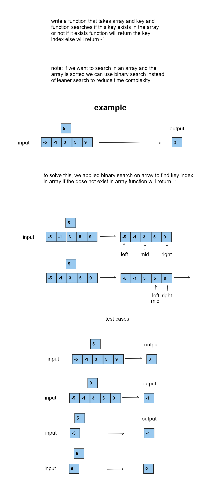
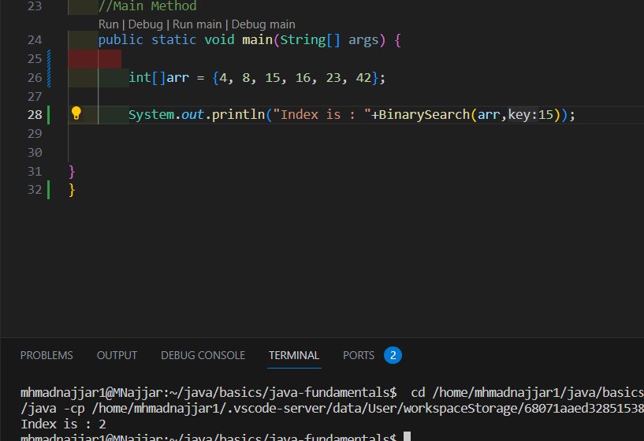
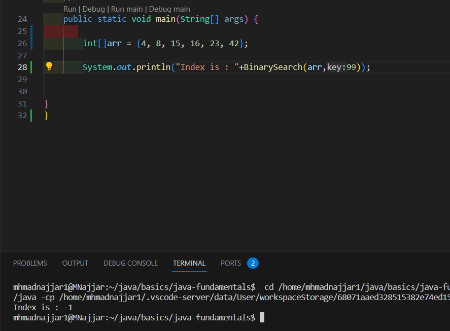
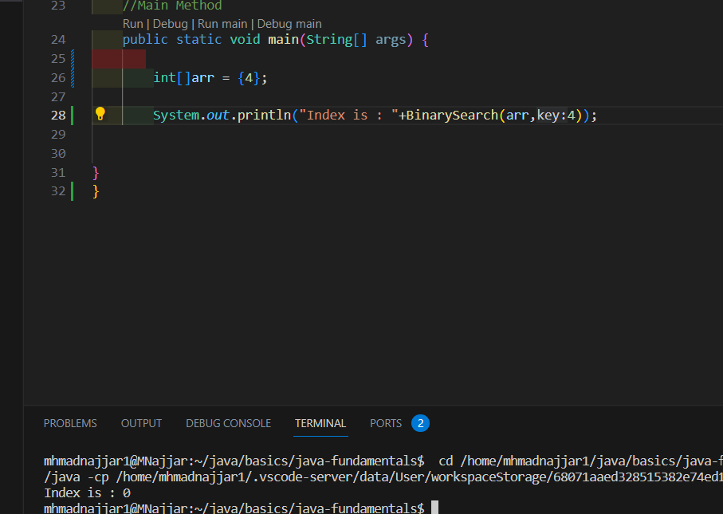
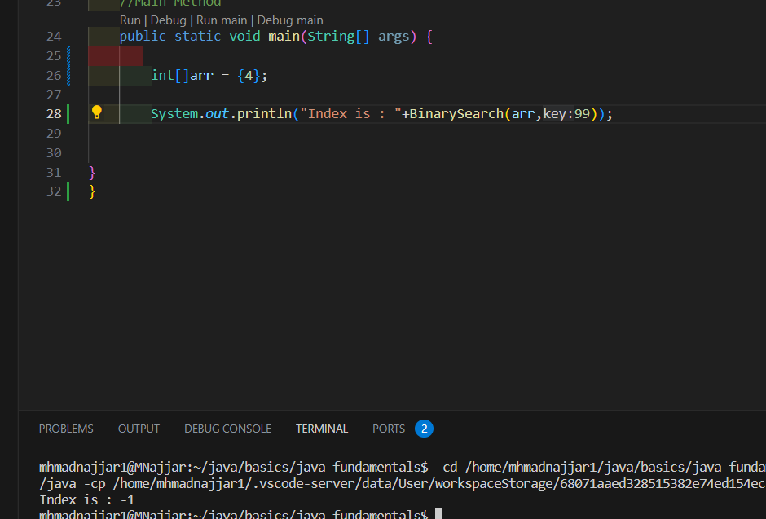

# Data Structure Binary Search on Array
<!-- Description of the  -->
challenge is a simple task where you are required to take an array and key and search the key index and return the index using binary search . 
## Whiteboard Process
<!-- Embedded whiteboard image -->


### the code
```
 public static int BinarySearch(int[] array, int key) {
    int left = 0;
    int right = array.length - 1;  

    while (left <= right) {
        int mid = left + (right - left) / 2;  //we do this instead of make left or right or mid long if (right +left ) is larger than int size 
        if (array[mid] == key) {
            return mid;
        }
        if (key > array[mid]) {
            left = mid + 1;
        } else {
            right = mid - 1;
        }
    }

    return -1;
}

```


### Approach & Efficiency
<!-- What approach did you take? Why? What is the Big O space/time for this approach? -->
### approach
1. **Initialization:** Set the initial values of the search boundaries. Typically, `left` is set to the first index (0) of the array, and `right` is set to the last index (`array.length - 1`).

2. **Search Loop:** Enter a loop that continues as long as the `left` boundary is less than or equal to the `right` boundary. This ensures there is still a valid search range to consider.

3. **Calculate Middle:** Calculate the middle index `mid` of the current search range using the formula `mid = left + (right - left) / 2`. This approach avoids potential overflow issues.

4. **Compare with Key:** Compare the element at index `mid` with the target `key` that you are searching for:
   - If the element at `array[mid]` is equal to the `key`, the search is successful, and you can return `mid` as the index where the `key` was found.
   - If the `key` is greater than the element at `array[mid]`, update `left = mid + 1` to restrict the search to the right half of the current range.
   - If the `key` is less than the element at `array[mid]`, update `right = mid - 1` to restrict the search to the left half of the current range.

5. **Repeat:** Repeat steps 3 and 4, adjusting the search range and recalculating the middle index until the search range is empty (i.e., `left` becomes greater than `right`).

6. **Key Not Found:** If the loop exits without finding the `key`, return a sentinel value (e.g., -1) to indicate that the `key` was not found in the array.


### Big O space/time
 * Time Complexity O(log(n))
*  Space Complexity O(1)
## Solution
<!-- Show how to run your code, and examples of it in action -->

### run code examples 






