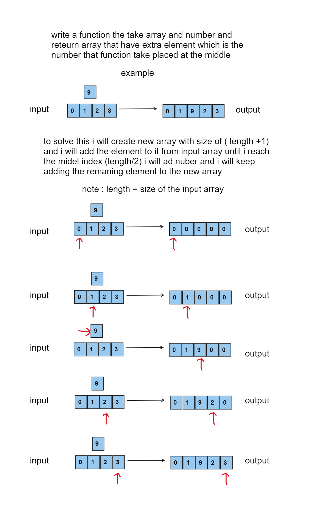
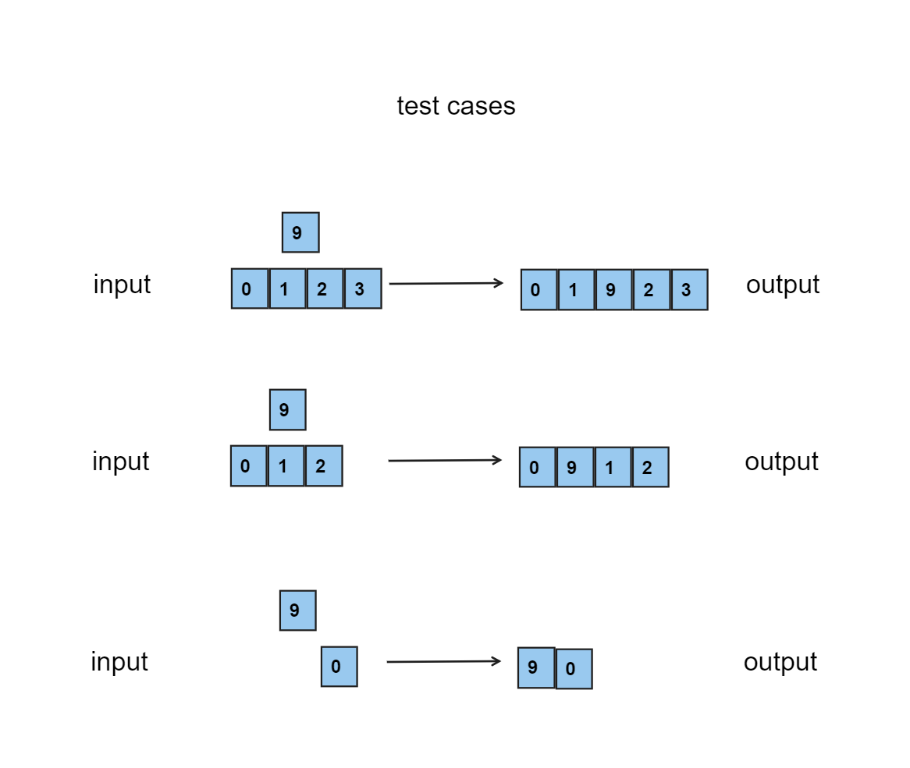
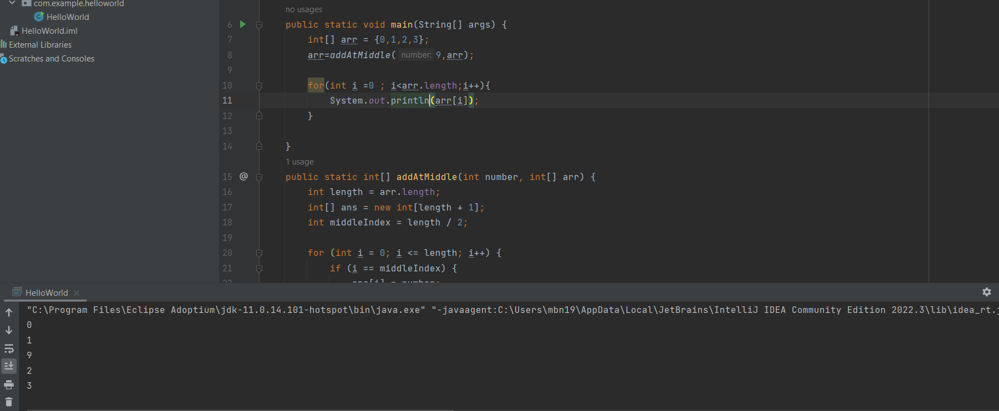
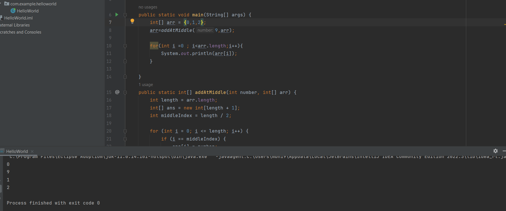
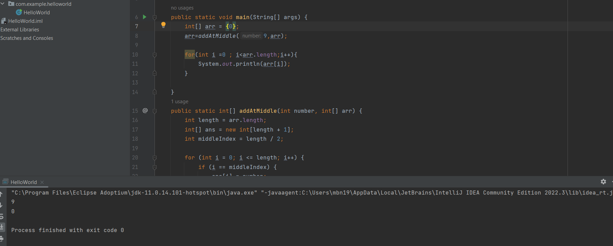

# Data Structure Insert at Mid of Array
<!-- Description of the  -->
challenge is a simple task where you are required to take an array and add element at the middle of the array and return the new array. 
## Whiteboard Process
<!-- Embedded whiteboard image -->

### test cases

### the code
```
 public static int[] addAtMiddle(int number, int[] arr) {
        int length = arr.length;
        int[] ans = new int[length + 1];
        int middleIndex = length / 2;

        for (int i = 0; i <= length; i++) {
            if (i == middleIndex) {
                ans[i] = number;
            } else if (i < middleIndex) {
                ans[i] = arr[i];
            } else {
                ans[i] = arr[i - 1];
            }
        }

        return ans;
    }

```

### Approach & Efficiency
<!-- What approach did you take? Why? What is the Big O space/time for this approach? -->
### approach
* Create a New Array: Initialize a new array, ans, with a size one element larger than the original array arr to accommodate the additional element.

* Calculate Middle Index: Determine the index at which the new element should be inserted. This is typically calculated as half the length of the array, ensuring that the new element is inserted at the middle position.

* Loop Through the Array: Iterate through the elements of the new array using a for loop. Begin from index 0 and continue up to the length of the original array.

* Insert Element at Middle: When the loop index matches the calculated middle index, insert the new element (number) into the ans array at that index.

* Copy Elements Before Middle: For indices less than the middle index, copy the corresponding element from the original array arr to the ans array.

* Copy Elements After Middle: For indices greater than the middle index, copy the element from the original array that corresponds to the previous index (i - 1) to the ans array. This effectively shifts the elements to accommodate the new insertion.

* Return Modified Array: Return the modified ans array, which now contains the new element inserted at the middle while maintaining the reversed order of elements.

### Big O space/time
 * Time Complexity O(N)
*  Space Complexity O(N)
## Solution
<!-- Show how to run your code, and examples of it in action -->

### run code examples 
**even element number**


**odd element number**

**single element**
