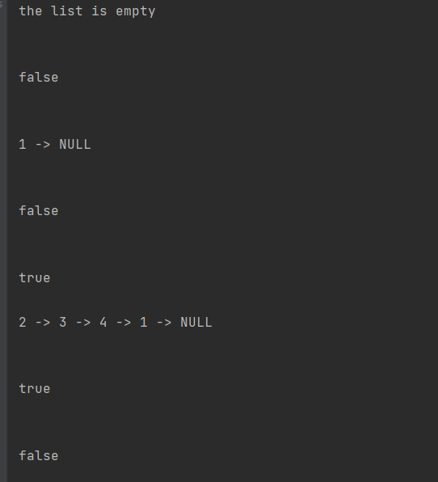
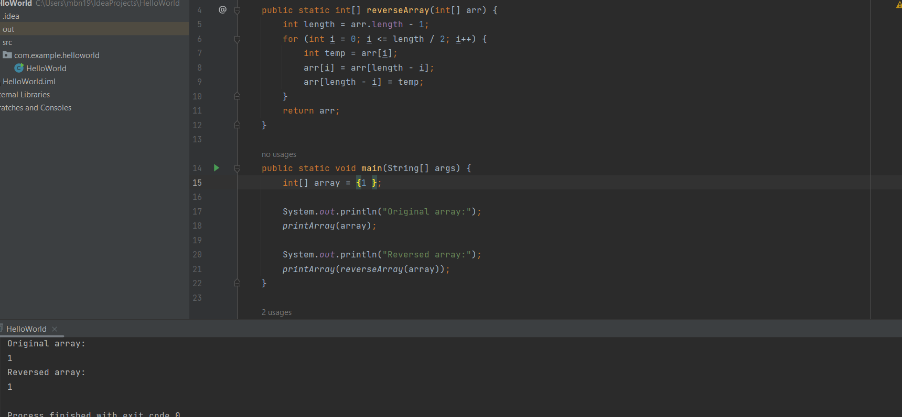

# linkedlist implementation  
<!-- Description of the  -->
the challenge is a task that Ruqier implements a singly linked list and adds 3 methods 
<ol>
<li>add at the first index of the list </li>  
<li>find if the element exists in the list</li>
<li>return all list elements in the string </li> 
</ol>

## Whiteboard Process
<!-- Embedded whiteboard image -->
.png)
### the code

```

public class LinkedList {
    private class Node {
        int val;
        Node next;

        Node(int val) {
            this.val = val;
        }
    }

    private Node head = null;
//    private Node tail = null; when we need add at the last of the list

    private boolean isEmpty() {
        return (head == null);
    }

    public void insert(int val) {
        if (isEmpty()) {
            head = new Node(val);
//            tail = head;

        } else {
            Node newNode = new Node(val);
            newNode.next = head;
            head = newNode;

        }

    }
    public boolean isInclude(int val) {
        Node temp=head;
        while (temp != null) {

            if(temp.val==val)return true;

            temp = temp.next;
        }

        return false;
    }

    @Override
    public String toString() {
        String ans = "";
        if (isEmpty()) {
            ans="the list is empty";

        } else {
            Node temp = head;

            while (temp != null) {

                ans += temp.val;
                ans += " -> ";
                temp = temp.next;
            }
            ans += "NULL";

        }

        return ans;
    }


```

### Approach & Efficiency
<!-- What approach did you take? Why? What is the Big O space/time for this approach? -->
### approach
1. **Create a Node**: Initialize a new node with the desired data value.

2. **Adjust New Node's Next Pointer**: Set the `next` pointer of the new node to point to the current head of the linked list. This step ensures that the new node is linked to the existing list.

3. **Update Head Pointer**: Update the `head` pointer of the linked list to reference the new node. This effectively designates the new node as the new head of the list.

4. **Finalization**: The new node is now successfully inserted at the head of the linked list, and the `head` pointer points to it. The other elements in the linked list can be accessed by following the `next` pointers.


### Big O space/time
 * Time Complexity  O(1)
 * Space Complexity O(1)
## Solution
<!-- Show how to run your code, and examples of it in action -->
### test code 
```
@Test
    void testInsertAndToString() {
        LinkedList linkedList = new LinkedList();
        linkedList.insert(3);
        linkedList.insert(7);
        linkedList.insert(10);

        assertEquals("10 -> 7 -> 3 -> NULL", linkedList.toString());
    }

    @Test
    void testIsInclude() {
        LinkedList linkedList = new LinkedList();
        linkedList.insert(3);
        linkedList.insert(7);
        linkedList.insert(10);

        assertTrue(linkedList.isInclude(7));
        assertFalse(linkedList.isInclude(5));
    }

``` 

## run code examples 

### **test on empty and single element and 4 element in list**

```
public static void main(String[] args) {
   LinkedList l =new LinkedList();   //empty
        System.out.println( l.toString()+"\n\n"); 
        System.out.println(l.isInclude(5)+"\n\n");
        
        
        l.insert(1);    //single element 
        System.out.println( l.toString()+"\n\n");  
        System.out.println(l.isInclude(2)+"\n\n");
        System.out.println(l.isInclude(1));

        l.insert(4);
        l.insert(3);
        l.insert(2); // 4 elements 
        System.out.println( l.toString()+"\n\n");
        System.out.println(l.isInclude(4)+"\n\n");
        System.out.println(l.isInclude(5));
    }

```
**the output**



### **even element number**

**single element**
