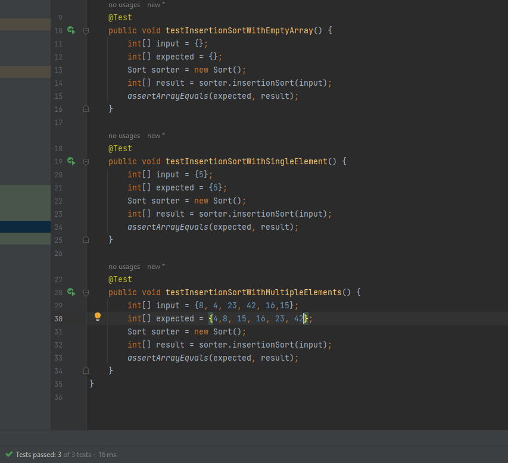

# Insertion Sort implementation  
<!-- Description of the  -->
apply insertion sort on array 

I/P : array of integer

O/P : array of integer


## Whiteboard Process
<!-- Embedded whiteboard image -->

### the code

```

 int [] insertionSort(int [] arr){
        if(arr.length <2) return arr;
        int length = arr.length , j,key;
        if(length <1) return arr;
        for(int i = 1 ; i<length;i++){
            j=i-1;
            key=arr[i];
            while(j>=0 && key<arr[j]){
                arr[j+1]=arr[j];
                j--;
            }
        arr[j+1]=key;
    }
        return arr;
    }


```

### pseudo code

```
function insertionSort(arr)
    if length of arr < 2
        return arr
    end if
    
    length = length of arr
    for i from 1 to length - 1
        j = i - 1
        key = arr[i]
        while j >= 0 and key < arr[j]
            arr[j + 1] = arr[j]
            j = j - 1
        end while
        arr[j + 1] = key
    end for
    
    return arr
end function


```


### Efficiency
 * Time Complexity  O(n^2) : because each element in array we almost walk through all element of array. 
 * Space Complexity O(1) : because no need for extra space whatever is the array size we will use the same space.

## Testing




