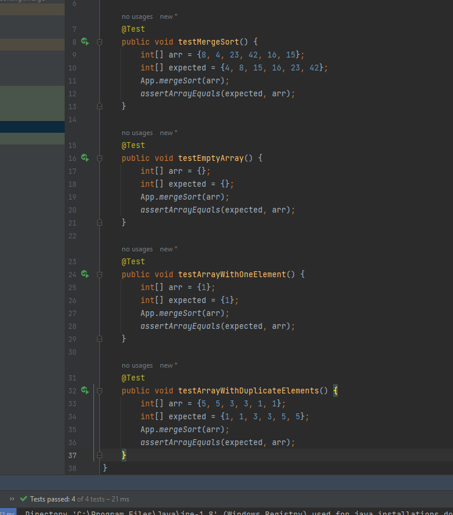

# Insertion Sort   
<!-- Description of the  -->


I/P : array of integer

O/P : array of integer
## Descreption

# Merge Sort Algorithm Trace

1. **Merge Sort Algorithm **

   Merge Sort is a divide-and-conquer sorting algorithm that efficiently sorts an array or list by recursively dividing it into smaller sub-arrays and then merging those sub-arrays to produce a sorted result. Let's trace the `mergeSort` function step by step using the sample array `[8, 4, 23, 42, 16, 15]`.

2. **Initial Array**


   [8, 4, 23, 42, 16, 15]

    
### Step 1: Split into Two Halves

The original array is divided into two equal-sized sub-arrays:

Left: [8, 4, 23]
Right: [42, 16, 15]

we will do that for each array until all array of size one (sorted array)


[8]  [4]  [23]  [42] [16]  [15]


### Step 2: Merge the Sorted Halves

The sorted left and right halves are merged to produce the final sorted array

[8,  4  , 23  , 42  ,16  ,  15]


## Tracing Process 
<!-- Embedded whiteboard image -->

### the code

```

 public class App {

    private static void merge(int[] left, int[] right, int[] arr){
        int i,j,k;
        i=j=k=0;
        int lLength=left.length;
        int rLength =right.length;
        while (i<lLength && j<rLength){
            if(left[i]<right[j]){
               arr[k++]= left[i++];
            }
            else{
                arr[k++]=right[j++];
            }
        }
        while(i < lLength){
            arr[k++]= left[i++];
        }
        while(j < rLength){
            arr[k++]=right[j++];
        }
    }

    public static void mergeSort(int[] arr) {
        int n = arr.length;
        if (n > 1) {

            int mid = n / 2;
            int[] left = new int[mid];
            int[] right = new int[n - mid];


            for (int i = 0; i < mid; i++) {
                left[i] = arr[i];
            }
            for (int i = mid; i < n; i++) {
                right[i - mid] = arr[i];
            }


            mergeSort(left);
            mergeSort(right);


            merge(left, right, arr);
        }
    }
    public static void main(String[] args) {


        int []arr = new int[]{8,4,23,42,16,15};
        for(int i = 0 ;i<arr.length; i++){
            System.out.print(arr[i]+" ");

        }
        System.out.println(" ");

        mergeSort(arr);
        for(int i = 0 ;i<arr.length; i++){
            System.out.print(arr[i]+" ");

        }

    }
}


```

### pseudo code

```

ALGORITHM Mergesort(arr)
    DECLARE n <-- arr.length

    if n > 1
      DECLARE mid <-- n/2
      DECLARE left <-- arr[0...mid]
      DECLARE right <-- arr[mid...n]
      // sort the left side
      Mergesort(left)
      // sort the right side
      Mergesort(right)
      // merge the sorted left and right sides together
      Merge(left, right, arr)

ALGORITHM Merge(left, right, arr)
    DECLARE i <-- 0
    DECLARE j <-- 0
    DECLARE k <-- 0

    while i < left.length && j < right.length
        if left[i] <= right[j]
            arr[k] <-- left[i]
            i <-- i + 1
        else
            arr[k] <-- right[j]
            j <-- j + 1

        k <-- k + 1

    if i = left.length
       set remaining entries in arr to remaining values in right
    else
       set remaining entries in arr to remaining values in left


```


### Efficiency
 * Time Complexity  O(nlog(n)) : because divides the array into halves until it reaches individual elements  and then combines them while comparing elements . 
 * Space Complexity O(n) : because it's requires additional memory for temporary arrays during the merge step.
## Testing




